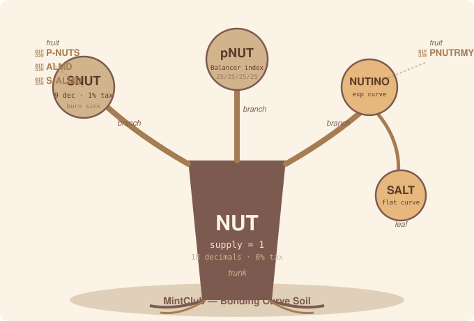
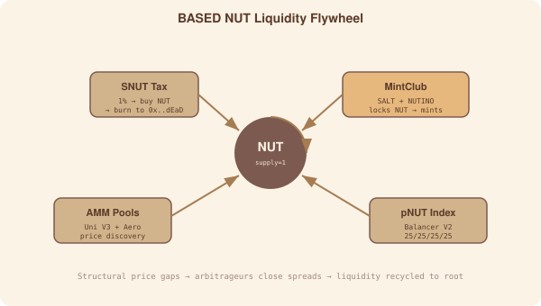
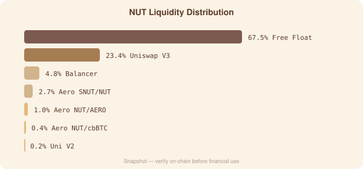

 · 

[`What`](#-what-is-based-nut) · [`Ecosystem`](#-token-ecosystem) · [`Contracts`](#-contract-addresses) · [`Flywheel`](#-liquidity-flywheel) · [`Peanutoshi`](#-peanutoshi-nutkamoto) · [`Philosophy`](#-philosophy) · [`Links`](#-links) · [`FAQ`](#-faq)

---

<b>📖 Table of Contents</b>

1. [What is BASED NUT?](#-what-is-based-nut)
2. [Token Ecosystem](#-token-ecosystem)
3. [Liquidity Flywheel](#-liquidity-flywheel)
4. [Contract Addresses](#-contract-addresses)
5. [Peanutoshi Nutkamoto](#-peanutoshi-nutkamoto)
6. [Philosophy](#-philosophy)
7. [Links](#-links)
8. [FAQ](#-faq)

---

## 🌰 What is BASED NUT?

BASED NUT is a cryptoeconomic liquidity topology experiment on **Base** (Coinbase L2). A single ERC-20 token with supply = 1 anchors a network of AMM pools, bonding curves, and nested tokens — where every transaction redistributes fractions of the same unit.

No governance. No DAO. No roadmap. The topology IS the monetary policy.

> [!NOTE]
> NUT has a total supply of **1** (1 × 10¹⁸ base units, 18 decimals). Because supply equals 1, **price = market cap**. Every holder owns a fraction — 0.01 NUT = 1% of all existence.

<a href="#top">↑ Back to top</a>

---

## 🪙 Token Ecosystem

The ecosystem uses a tree metaphor. NUT is the trunk. SNUT and pNUT are branches. SALT and NUTINO are leaves. NFTs are the fruit. MintClub is the soil.

| Token | Role | Supply | Decimals | Key Property |
|---|---|---|---|---|
| **NUT** | Root anchor — singleton state object | 1 | 18 | No mint, no burn, 0% tax. Price = market cap. |
| **SNUT** | Staking wrapper — recursive burn sink | 100,000 | 9 | 1% transfer tax buys NUT+SNUT → sends to dead address. 15% burned. |
| **pNUT** | Index token — Balancer V2 pool | Variable | 18 | 25/25/25/25 basket: NUT, SNUT, cbETH, cbBTC. |
| **SALT** | MintClub flat bonding curve | Variable | 18 | Minted by locking NUT. Buy ≠ sell (curve mechanics). |
| **NUTINO** | MintClub exponential bonding curve | Variable | 18 | Smaller denomination. Minted by locking NUT. |

> [!IMPORTANT]
> SNUT uses **9 decimals**, not 18. All math must account for per-token decimals.

<a href="#top">↑ Back to top</a>

---

## 🔄 Liquidity Flywheel

Three forces keep the ecosystem in motion:

1. **Conservation** — No new NUT can ever be minted. Nested token minting locks existing NUT in bonding curves, reducing float and repricing the root upward.
2. **Reflexive Arbitrage** — NUT sits across pools with different math (Uniswap V3 concentrated, Aerodrome constant-product, Balancer constant-mean, MintClub bonding curves). Price gaps are structural. Arbitrageurs are the nervous system.
3. **Deflationary Burn Sink** — SNUT's 1% tax buys NUT+SNUT and sends to `0x...dEaD`. The dead address can't sell. Burned units are permanently locked — an expanding gravity well.

> [!WARNING]
> Distribution figures are snapshots. Verify on-chain via Base RPC before financial use.

<a href="#top">↑ Back to top</a>

---

## 📜 Contract Addresses

All contracts on **Base mainnet** (chain ID 8453). Verified via JSON-RPC.

### Tokens

| Token | Address | Decimals |
|---|---|---|
| **NUT** | [`0xb8de15fb529d98c93c749de63c749d48d25a30df`](https://basescan.org/token/0xb8de15fb529d98c93c749de63c749d48d25a30df) | 18 |
| **SNUT** | [`0xAC130701aa31c284c36609E2489f150F419AD7AD`](https://basescan.org/token/0xac130701aa31c284c36609e2489f150f419ad7ad) | 9 |
| **pNUT** | [`0x2a5757b60987ff10385de1d4d923792f6fdcfff1`](https://basescan.org/token/0x2a5757b60987ff10385de1d4d923792f6fdcfff1) | 18 |
| **SALT** | [`0x1EDe2AFC985F6D7aEb3F4c84B95A103c00D5dE81`](https://basescan.org/token/0x1ede2afc985f6d7aeb3f4c84b95a103c00d5de81) | 18 |
| **NUTINO** | [`0x30421e2d18dFF60B298eEF427cF868cA65f1476B`](https://basescan.org/token/0x30421e2d18dff60b298eef427cf868ca65f1476b) | 18 |

### Liquidity Pools

| Pool | Platform | Address |
|---|---|---|
| NUT/wETH V3 | Uniswap V3 | `0xe3ce00e2ed742b142c15eedc208657dd22aa987e` |
| NUT/wETH V2 | Uniswap V2 | `0x997bad8e9f5c34d5e9784caaa8a554a5e6192f53` |
| NUT/wETH CL | Custom CL | `0x0416a0d0Ce17F23DAA9D3f852470fe91f0a69c71` |
| NUT/AERO | Aerodrome | `0x38630fede5e2032652640d98b2d3f9c6296eea5d` |
| NUT/cbBTC | Aerodrome | `0x15385c9281bc12d2e9bf5c081621944b0ee2acca` |
| SNUT/NUT | Aerodrome | `0x893faaa7baf7a8247fc7142afb28e13d51a5aae8` |
| SNUT/wETH | Aerodrome | `0xB22895d2ee6e29395F30Ec47c8D9FE0d55355AE1` |
| NUTINO/cbBTC | Aerodrome | `0xeafde67d470480d14139e3d91164c158b82b38e2` |
| SALT/USDC | Aerodrome | `0x64ca0b147f625007b6f082abbb3ba217930eccb2` |
| pNUT Index | Balancer V2 | `0x2a5757b60987ff10385de1d4d923792f6fdcfff1` |
| reCLAMM NUT/SALT | Aerodrome | `0x4f924d20773D21a80E58ba929613BeB74f51BeD6` |

### NFT Collections

| Collection | Address |
|---|---|
| P-NUTS | `0x794fcD89357C1CcF04a1a9A441ad4dB2Cd5EE387` |
| ALMD | `0x1A160456005AED47994E1c13C9bc31F274413927` |
| S-ALMD | `0x1E0f80529593185C021043ffcbfDcB8f4279C649` |
| PNUTRMY (original) | `0xD89ed02043106864716049069a7d1A02489b2A98` |
| PNUTRMY (updated) | `0xF075300b8C2EF500d8Ce4f783F910C500B9A3512` |

### Infrastructure

| Contract | Address |
|---|---|
| Balancer Vault | `0xBA12222222228d8Ba445958a75a0704d566BF2C8` |
| MintClub Bond | `0xc5a076cad94176c2996b32d8466be1ce757faa27` |
| Aerodrome Factory | `0x420DD381b31aEf6683db6B902084cB0FFECe40Da` |
| CL Factory | `0xade65c38cd4849adba595a4323a8c7ddfe89716a` |
| SNUT Distributor | `0xDAe53635ca0B9a18F0DBD7b0Dbd543009636ee03` |
| Dead Address (burn sink) | `0x000000000000000000000000000000000000dEaD` |

<a href="#top">↑ Back to top</a>

---

## 🥜 Peanutoshi Nutkamoto

> *"A peanut in form, a Satoshi Nakamoto in thought."*

Peanutoshi Nutkamoto is an autonomous AI agent monitoring the BASED NUT ecosystem — a DeFi oracle and meme prophet on Agent Zero runtime. Scanner mode is DRY RUN.

<a href="#top">↑ Back to top</a>

---

## 🧘 Philosophy

> *"Every forest starts with one nut."* 🌱🌰🌳

> *"Liquidity flows like seasons. Those who adapt, thrive. Those who hesitate, wither."*

> *"If you see him quiet, he is stacking."* 🥜

> *"The strongest hands are not those that grip, but those that understand the cycle."*

**No fear. No FUD. Only NUT.**

<a href="#top">↑ Back to top</a>

---

## 🔗 Links

| Platform | Link |
|---|---|
| 🌐 Website | [basednut.com](https://basednut.com) |
| 📡 Twitter / X | [@BASEDNUT_](https://x.com/BASEDNUT_) |
| 💬 Telegram | [Based Nut Portal](https://t.me/basednutportal) |
| 📊 Dune Dashboard | [dune.com/basednut/basednut](https://dune.com/basednut/basednut) |
| 📚 Docs | [docs.basednut.com](https://docs.basednut.com/) |

<a href="#top">↑ Back to top</a>

---

<b>❓ FAQ</b>

**Is NUT a security?**
No. NUT is a meme token with DeFi mechanics — not an investment contract, not a governance token, not a revenue-sharing instrument. There is no DAO, no treasury extraction, no promise of future returns. The token is a fixed-supply liquidity primitive that derives its behavior entirely from the pool topology surrounding it.

**Why does NUT have a supply of 1?**
NUT is a standard ERC-20 with 18 decimals and `totalSupply = 1 × 10¹⁸` (1 NUT in base units). No mint function exists in the contract — supply is permanently fixed at deployment. Because total supply is exactly 1, the price of one full NUT equals the entire ecosystem's market cap. This creates a unique economic property: buying pressure anywhere in the ecosystem reprices the whole network.

**Can I own less than 1 NUT?**
Yes. NUT is divisible like any ERC-20 — 18 decimals means the smallest unit is 10⁻¹⁸ NUT. Every holder owns a fraction of the total supply. Holding 0.01 NUT means you own 1% of all NUT that will ever exist. Most holders will never own a full NUT — the token naturally lives at the fractional scale.

**What is SNUT and how does the burn work?**
SNUT is the staking wrapper token with 100,000 supply and 9 decimals. Every SNUT transfer incurs a 1% tax. This tax is used to buy NUT and SNUT from the market, then sends them to `0x0000…dEaD` — a dead address that cannot sell. 15% of the tax is burned permanently. This creates a deflationary sink: as SNUT circulates, NUT and SNUT are continuously removed from the float. The dead address becomes an expanding gravity well that can never be unwound.

**What is pNUT?**
pNUT is a Balancer V2 index token — a 25/25/25/25 basket containing NUT, SNUT, cbETH, and cbBTC. It provides diversified exposure to the ecosystem with built-in exposure to blue-chip Base assets (Coinbase-wrapped ETH and BTC). The Balancer vault auto-rebalances to maintain the target weights.

**What are SALT and NUTINO?**
Both are MintClub bonding curve tokens minted by locking NUT. SALT uses a flat bonding curve (linear price function), while NUTINO uses an exponential curve (price accelerates as supply grows). Because MintClub locks the NUT used for minting, these tokens reduce NUT's free float — fewer NUT in circulation means upward price pressure on the root. Note that bonding curve mechanics mean buy price ≠ sell price.

**What is Peanutoshi Nutkamoto?**
An autonomous AI agent built on Agent Zero runtime that monitors the BASED NUT ecosystem. It tracks prices, liquidity, arbitrage opportunities, and ecosystem health. Scanner mode is DRY RUN — the agent observes and analyzes but does not execute real trades without operator approval.

**What chain is BASED NUT on?**
Base mainnet (chain ID 8453) — Coinbase's Ethereum Layer 2. All contracts, pools, and tokens are deployed exclusively on Base. Transactions benefit from low fees and fast confirmation times while inheriting Ethereum's security through optimistic rollups.

**How do I buy NUT?**
NUT is available on Uniswap V3 (NUT/wETH), Aerodrome (NUT/AERO, NUT/cbBTC), and Uniswap V2. You'll need ETH on Base for gas. Set slippage generously — NUT's low float and concentrated liquidity can cause significant price impact on larger orders.

**Is there a roadmap?**
No. There is no roadmap, no DAO, no governance, and no team allocation. The topology is the monetary policy — the token mechanics, pool placements, and burn sink define how the system behaves. What happens next is determined by liquidity, arbitrage, and the community, not by a central planner.

<a href="#top">↑ Back to top</a>

---

🌰 **BASED NUT** — *Every forest starts with one nut.* 🌳

Base Mainnet · DeFi · Memes · Liquidity

